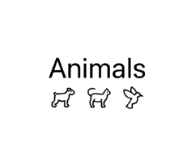

# Class Notes #6 - Building Our First App

It's time to build an app! It will be very simple, but we now know enough to start coding iOS application.

## Create a project
1. Open XCode and create a new project (not a playground).
1. Select iOS App.
1. Select the default settings and save your project.

You will see the following starter code provided by Xcode:
```swift

import SwiftUI

struct ContentView: View {
    var body: some View {
        VStack {
            Image(systemName: "globe")
                .imageScale(.large)
                .foregroundStyle(.tint)
            Text("Hello, world!")
        }
        .padding()
    }
}

#Preview {
    ContentView()
}

```
There's a lot here so let's unpack it line by line.
```swift
import SwiftUI //This imports the built-in functions and
//properties we need to build apps.
```

```swift
struct ContentView: View { //This opens a "view" structure

    var body: some View { //This opens a body container
    //All content must be within this body

        VStack { //This is a vertical stack
            Image(systemName: "globe") //This is a pic of a globe
                .imageScale(.large)
                .foregroundStyle(.tint)
            Text("Hello, world!") // Some text
        }
        .padding() //Add some nice spacing
    }
}
```
```swift
//This loads the preview so you can see what the app looks like.
#Preview {
    ContentView()
}
```

## Stacks
Items placed within a `VStack` will be stacked vertically. Items placed within an `HStack` will be stacked horizontally.

Here is an example of a VStack with a message and a button:
```swift
VStack{
    Text("This is a VStack")
        .font(.title)
    Button("This is a button!"){
        //do something
    }
    .padding()
    .background(Color.red)
    .foregroundStyle(.white)
    .clipShape(Capsule())
}
```
If you use HStack instead of VStack, the items will be stacked vertically. 

|  | |
|----------|----------|
| We can combine stacks to create a layout. For example, to produce the layout on the right, we can use the following code.| |

```swift
VStack{
    Text("Animals")
        .font(.title)
    
    HStack{
        Image(systemName: "dog")
        Image(systemName: "cat")
        Image(systemName: "bird")
    }
}
```

## Buttons
Most apps have buttons, so let's turn our animals into buttons.

The basic structure for a button in SwiftUI is: 
```swift
Button(action: {
    //Code that runs when button presse
}, label: {
    //Visual representation of the button
})
```
So, if we can to turn the images into buttons, we can start with this:
```swift
Button(action: {
    //do something
}, label: {
    Image(systemName: "dog")
})
``` 

The following code, which will be discussed in class, creates three buttons that are counters, counting and display the number of times each button was pressed. Study the code until you understand how it is operating. 
```swift
struct ContentView: View {
    // We initialize variables before the body
    // We must use the @State annotation to tell Swift that we want to monitor the "state" of these variables. 
    // If there state changes (ie. the values changes), the UI must be changed. 
    @State var numDogs: Int = 0
    @State var numCats: Int = 0
    @State var numBirds: Int = 0
    
    var body: some View {
        VStack{
            //Title
            Text("Animals")
                .font(.title)
            //Buttons
            HStack{
                Button(action: {
                    numDogs += 1
                }, label: {
                    Image(systemName: "dog")
                        .resizable()// Make the image resizable
                        .frame(width: 50, height: 50) // Set a larger size
                        .padding()
                })
                Button(action: {
                    numCats += 1
                }, label: {
                    Image(systemName: "cat")
                        .resizable()// Make the image resizable
                        .frame(width: 50, height: 50) // Set a larger size
                        .padding()
                })
                Button(action: {
                    numBirds += 1
                }, label: {
                    Image(systemName: "bird")
                        .resizable()// Make the image resizable
                        .frame(width: 50, height: 50) // Set a larger size
                        .padding()
                })
            }
            //Counters
            HStack{
                Text("Dogs: \(numDogs)")
                    .padding()
                Text("Cats: \(numCats)")
                    .padding()
                Text("Birds: \(numBirds)")
                    .padding()
            }
        }
    }
}
```
